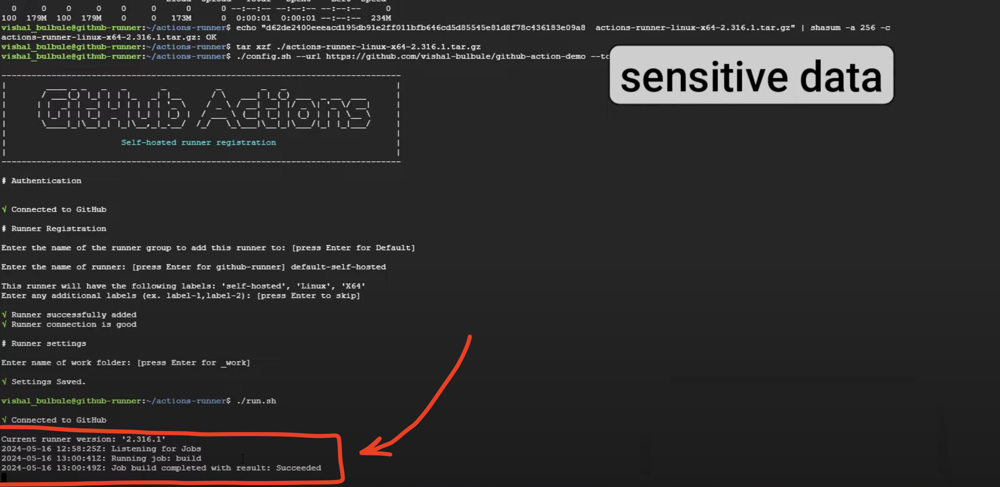

# GitHub Runner

## Description

image comes from below youtube link

[Youtube Link](https://www.youtube.com/watch?v=2_TPy4GERs0&t=593s&ab_channel=TechTrapture)

## Create a github runner 

in the below image, we are create a github runner. You must go to Settings, Actions, Runners, and then click on the "Add Runner" button.

- 

- 

## Sentesive information
in here you must select linux and collect those information.
please save those information in a safe place. you will need them later.

## Install the runner

In here you should go step by step and install the runner.

## Run the runner

in here you must select name for your runner and select the path 

in the below image, you can check if you have successfully installed the runner or not.

## Yml file

in here you can select the yml file and add the below code in it.

The name of self-host is located here.

now, you can submmit the yml file and check if the self-hosted runner is working or not, in the linux server

## here you can see the Action that runner will created.

## check the result

When is running, the github action will be activated.

Some information about github action

